## 前言

這篇文章希望能幫助一些用不到 OneDrive 並已移除，但卻發現預設檔案路徑還是在 OneDrive 下面的人，以至於檔案很難管理，將帶大家把系統資料夾的路徑調整回你想要的位置，希望能讓大家的系統更乾淨。
## 操作步驟

### 移動資料夾

我們移除 OneDrive 後，系統預設路徑（像文件、桌面等）還是會指向 OneDrive


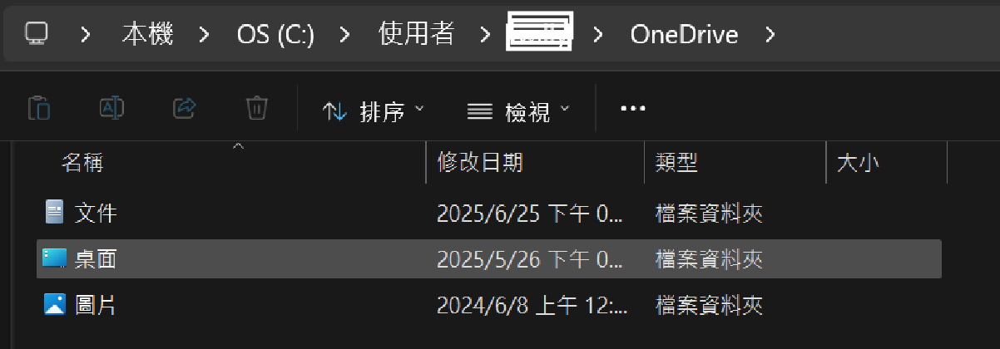

而右鍵查看內容可以看到實際位置

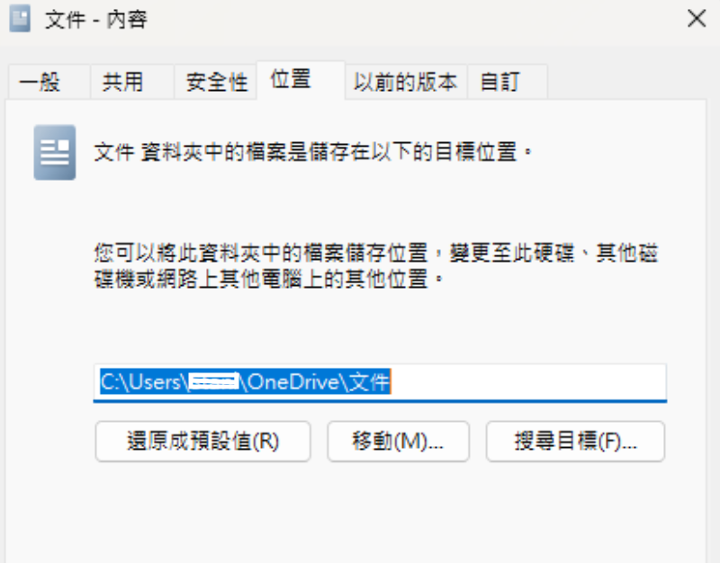

而我自己希望把這些系統資料夾移到 D 槽下

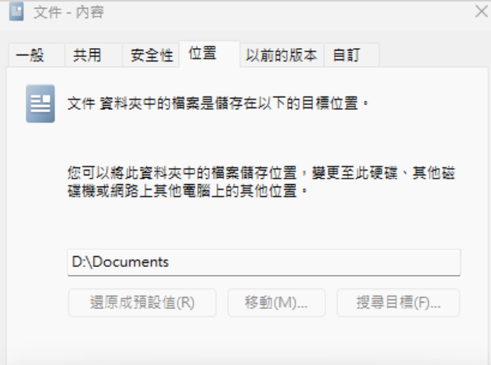


但移動時可能會遇到 **無法搬移** 的狀況，因為註冊表設定還是指向 OneDrive 的路徑。

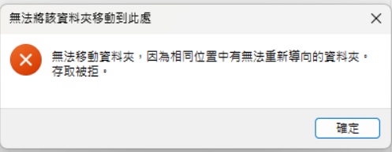

因此需要透過登錄編輯器來調整這些路徑設定。
### 修改註冊表



註冊表操作有風險，建議先備份重要資料再進行。


按下 `Win` + `R`，輸入 `regedit`，按下 `Enter` 開啟登錄編輯器

導航到以下路徑：

```
HKEY_CURRENT_USER\Software\Microsoft\Windows\CurrentVersion\Explorer\User Shell Folders
```

找到 `Personal`、`Desktop`、`My Pictures`、`My Videos` 等項目 (基本上在 OneDrive 下的都可以修改)

- `%USERPROFILE%\OneDrive\桌面` → `D:\Desktop`
- `%USERPROFILE%\OneDrive\文件` → `D:\Documents`
- `C:\Users\User\OneDrive\圖片` → `D:\Pictures`

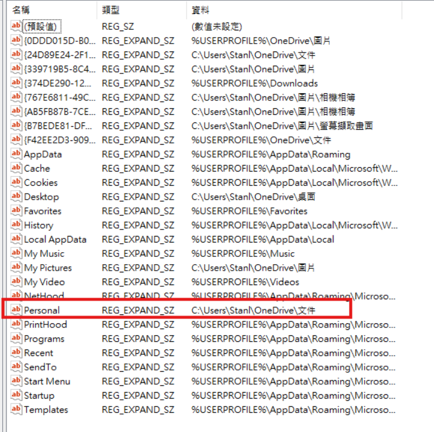

雙擊每個你要移動的項目，把路徑改成你想要的位置（例：`D:\Documents`）

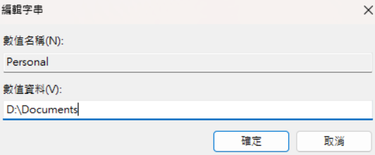

### 完成後重啟系統

關閉登錄編輯器，並 **重新開機**，讓 Windows 重新載入這些資料夾路徑設定。

這時再重新設定系統資料夾的路徑，讓它們指向新的位置。

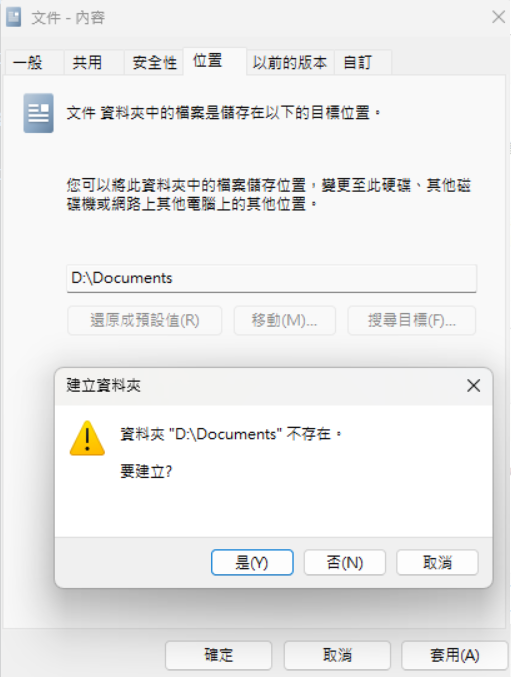
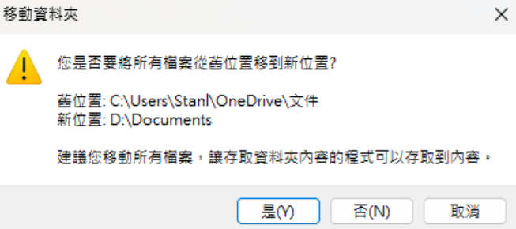
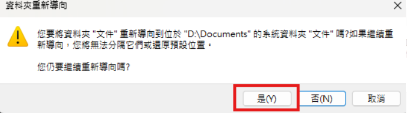

完成後會發現已經成功把系統資料夾的路徑指向新的位置了，裡面的檔案也都搬過來了。

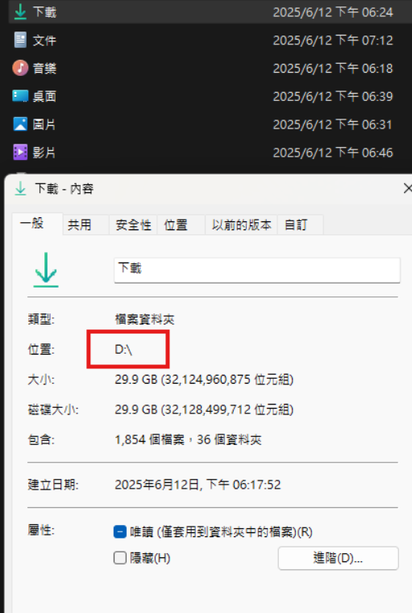

現在你就有了乾淨的系統資料夾路徑。

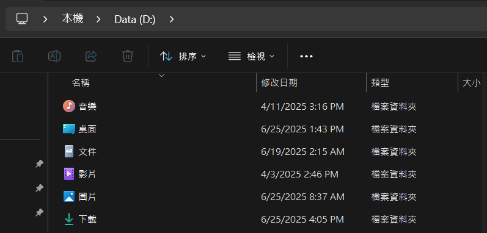


### 參考資料

- https://support.microsoft.com/zh-tw/topic/%E8%AE%8A%E6%9B%B4%E5%84%B2%E5%AD%98%E8%B3%87%E6%96%99%E5%BA%AB%E7%9A%84%E9%A0%90%E8%A8%AD%E8%B3%87%E6%96%99%E5%A4%BE-9545fd65-591f-4feb-92b8-9bbc9f5f823c
- https://support.microsoft.com/zh-tw/topic/%E5%A6%82%E4%BD%95%E5%B0%87%E4%BD%BF%E7%94%A8%E8%80%85%E7%9A%84%E6%AE%BC%E5%B1%A4%E8%B3%87%E6%96%99%E5%A4%BE%E9%87%8D%E6%96%B0%E5%B0%8E%E5%90%91%E8%87%B3%E6%8C%87%E5%AE%9A%E7%9A%84%E8%B7%AF%E5%BE%91%E4%BD%BF%E7%94%A8%E8%A8%AD%E5%AE%9A%E6%AA%94%E6%A8%99%E8%A8%98-ed6289ae-1f9c-b874-4e8c-20d23ea65b2e