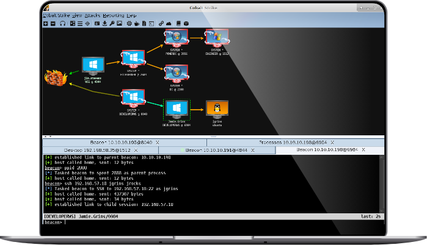

這篇文章整理我在網路上蒐集到 Cobalt Strike 的 Yara rules，可以從甚麼地方去分析一隻樣本是不是 Cobalt Strike。接下來會逐一說明這些 YARA Rules為什麼會這樣寫，以及根據哪些特徵去設計。
## Cobalt Strike 是什麼？

Cobalt Strike 是合法的滲透測試工具，原本是給紅隊用來模擬駭客攻擊的。因為功能太強，很多駭客也拿來當攻擊工具，所以在資安圈很常遇到。

[Cobalt Strike 官網截圖](https://www.cobaltstrike.com/)
## 名詞解釋

- **Beacon**: Cobalt Strike 的後門程式，會在受害者電腦上執行，並與攻擊者的伺服器通訊。
- **Team Server**: Cobalt Strike 的伺服器端程式，負責管理 Beacon 和提供攻擊者介面。


## 特徵

### Beacon Strings

Beacon 在跟 Team Server 通訊的時候，會傳一些像是 Debug 的訊息，這些字串就能拿來當作特徵來辨識是不是 Cobalt Strike。

[Windows_Trojan_CobaltStrike_ee756db7](https://github.com/elastic/protections-artifacts/blob/main/yara/rules/Windows_Trojan_CobaltStrike.yar#L423-L491)
```c
$a26 = "could not spawn %s (token): %d" ascii fullword
$a28 = "could not run %s as %s\\%s: %d" ascii fullword
$a30 = "kerberos ticket use failed:" ascii fullword
$a31 = "Started service %s on %s" ascii fullword
$a33 = "I'm already in SMB mode" ascii fullword
$a41 = "beacon.x64.dll" ascii fullword
$a47 = "beacon.dll" ascii fullword
$a50 = "%02d/%02d/%02d %02d:%02d:%02d" ascii fullword
```
[HKTL_CobaltStrike_Beacon_Strings](https://github.com/Neo23x0/signature-base/blob/master/yara/apt_cobaltstrike.yar#L54-L67)
```c
$s1 = "%02d/%02d/%02d %02d:%02d:%02d"
$s2 = "Started service %s on %s"
$s3 = "%s as %s\\%s: %d"
```

不過由於字串可以動態產生，因此一些樣本，需要實際執行後才會在記憶體中被掃描並命中。
### Unlicensed Software

這條 Rule 主要是針對 Cobalt Strike 的試用版（trial version）所留下的偵測特徵。Cobalt Strike 的作者在 trial 版本中刻意插入 EICAR 測試字串（防毒軟體會當病毒來偵測），目的就是讓防毒軟體會直接偵測並擋下。

另外也包含 libgcj-12.dll，這是部分盜版或自行修改過的 Beacon loader 在用 GCJ 重新打包時常出現的 DLL 名稱。

[HKTL_Unlicensed_CobaltStrike_EICAR_Jul18_5](https://github.com/Neo23x0/signature-base/blob/master/yara/apt_darkhydrus.yar#L69-L90)
```c
$x1 = "X5O!P%@AP[4\\PZX54(P^)7CC)7}$EICAR-STANDARD-ANTIVIRUS-TEST-FILE!$H+H*AAAAAAAAAAAAAAAAAAAAAAAAAAAAAAAAAAAAAAAAAAAAAAAAAAAAAAAAAAAAAAAAAAAAAAAAAAAAAAAAAAAAAAAAAAAAAAAAAAAAAAAAAAAAAAAAAAAAAAAAAAAAAAAAAAAAAAAAAAAAAAAAAAAAAAAAAAAAAAAAAAAAAAAAAAAAAAAAAAAAAAAAAAAAAAAAAAAAAAAAAAAAAAAAAAAAAAAAAAAAAAAAAAAAAAAAAAAAAAAAAAAAAAAAAAAAAAAAAAAAAAAAAAAAAAAAAAAAAAAAAAAAAAAAAAAAAAAAAAAAAAAAAAAAAAAAAAAAAAAAAAAAAAAAAAAAAAAAAAAAAAAAAAAAAAAAAAAAAAAAAAAAAAAAAAAAAAAAAAAAAAAAAAAAAAAAAAAAAAAAAAAAAAAAAAA"

$s1 = "X5O!P%@AP[4\\PZX54(P^)7CC)7}$EICAR-STANDARD-ANTIVIRUS-TEST-FILE!$H+H*" fullword ascii
$s2 = "libgcj-12.dll" fullword ascii /* Goodware String - occured 3 times */
```
### Beacon Loader

這條 YARA 規則是用來偵測 Cobalt Strike 各版本常見的 XOR 殼碼解密流程。這段解密殼碼會先解開裡面的資料，然後直接跳到 payload 開始執行 Beacon 的核心功能。

[Cobaltbaltstrike_strike_Payload_XORed](https://github.com/Neo23x0/signature-base/blob/master/yara/gen_cobaltstrike_by_avast.yar#L638-L658)
```c
strings:
    $h01 = { 10 ?? 00 00 ?? ?? ?? 00 ?? ?? ?? ?? 61 61 61 61 }
condition:
    //x86 payload
    uint32be(@h01+8) ^ uint32be(@h01+16) == 0xFCE88900 or
    //x64 payload
    uint32be(@h01+8) ^ uint32be(@h01+16) == 0xFC4883E4 or
    //x86 beacon
    uint32be(@h01+8) ^ uint32be(@h01+16) == 0x4D5AE800 or
    //x64 beacon
    uint32be(@h01+8) ^ uint32be(@h01+16) == 0x4D5A4152 or
    //NOP slide
    uint32be(@h01+8) ^ uint32be(@h01+16) == 0x90909090
```

[cobaltstrike_beacon_xored_x86](https://github.com/avast/ioc/blob/master/CobaltStrike/yara_rules/cs_rules.yar#L705-L726)
```c
strings:
	// x86 xor decrypt loop
	// 52 bytes variant
	$h01 = { FC E8??000000 [0-32] EB27 ?? 8B?? 83??04 8B?? 31?? 83??04 ?? 8B?? 31?? 89?? 31?? 83??04 83??04 31?? 39?? 7402 EBEA ?? FF?? E8D4FFFFFF }
	// 56 bytes variant
	$h02 = { FC E8??000000 [0-32] EB2B ?? 8B??00 83C504 8B??00 31?? 83C504 55 8B??00 31?? 89??00 31?? 83C504 83??04 31?? 39?? 7402 EBE8 ?? FF?? E8D0FFFFFF }
	// end of xor decrypt loop
	$h11 = { 7402 EB(E8|EA) ?? FF?? E8(D0|D4)FFFFFF }
condition:
	any of ($h0*) and (
		uint32be(@h11+12) ^ uint32be(@h11+20) == 0x4D5AE800 or
		uint32be(@h11+12) ^ uint32be(@h11+20) == 0x904D5AE8 or
		uint32be(@h11+12) ^ uint32be(@h11+20) == 0x90904D5A or
		uint32be(@h11+12) ^ uint32be(@h11+20) == 0x9090904D or
		uint32be(@h11+12) ^ uint32be(@h11+20) == 0x90909090
	)
```

### Config Blob

Cobalt Strike Beacon 會內嵌設定資料，包含像是 C2 的頻率、通訊協定、HTTP header 等參數，如下：
```c
set global_option "value";

protocol-transaction {
     set local_option "value";

     client {
          # customize client indicators
     }

     server {
          # customize server indicators
     }
}
```
而這些資料會在 Beacon 解密後載入到記憶體中，我們就可以從這些資料來偵測 Cobalt Strike。

[cobaltstrike_beacon_x64](https://github.com/avast/ioc/blob/master/CobaltStrike/yara_rules/cs_rules.yar#L634-L651)
```c
strings:
	// x64 default MZ header
	$h01 = { 4D 5A 41 52 55 48 89 E5 48 81 EC 20 00 00 00 48 8D 1D EA FF FF FF 48 89 }
	// decoded config blob
	$h11 = { 00 01 00 01 00 02 ?? ?? 00 02 00 01 00 02 ?? ?? 00 }
	// xored config blob v3
	$h12 = { 69 68 69 68 69 6B ?? ?? 69 6B 69 68 69 6B ?? ?? 69 }
	// xored config blob v4
	$h13 = { 2E 2F 2E 2F 2E 2C ?? ?? 2E 2C 2E 2F 2E 2C ?? ?? 2E }
```
### Beacon 通訊
Beacon 在與 Team Server 通訊時，會利用HTTP 或 HTTPS 協定來傳送資料，這些通訊的資料就能當一個特徵來偵測 Cobalt Strike。就像我們剛剛看到的靜態字串一樣，也會包含通訊的參數。

[Windows_Trojan_CobaltStrike_ee756db7](https://github.com/elastic/protections-artifacts/blob/main/yara/rules/Windows_Trojan_CobaltStrike.yar#L423-L491)
```c
strings:
	$a50 = "%02d/%02d/%02d %02d:%02d:%02d" ascii fullword
	$a51 = "Content-Length: %d" ascii fullword
```

而下面的 Rule 則是針對 SMB 模式（橫向移動）連線所用的預設 pipename `\\.\pipe\MSSE-###-server`

[CobaltStrike_Resources_Artifact32_v3_14_to_v4_x](https://github.com/chronicle/GCTI/blob/main/YARA/CobaltStrike/CobaltStrike__Resources_Artifact32_and_Resources_Dropper_v1_45_to_v4_x.yara#L62-L89)
```c
$pushFmtStr = {	C7 [3] 5C 00 00 00 C7 [3] 65 00 00 00 C7 [3] 70 00 00 00 C7 [3] 69 00 00 00 C7 [3] 70 00 00 00 F7 F1 C7 [3] 5C 00 00 00  C7 [3] 2E 00 00 00 C7 [3] 5C 00 00 00 }
$fmtStr = "%c%c%c%c%c%c%c%c%cMSSE-%d-server"
```
### Sleep Mask
最後的是 Cobalt Strike 的 Sleep Mask。這個功能是用來隱藏 Beacon 的行為，它會在 Beacon 進入睡眠等待的時候，把自己的記憶體區段加密或覆蓋，降低被偵測的機率。

[Windows_Trojan_CobaltStrike_b54b94ac](https://github.com/elastic/protections-artifacts/blob/main/yara/rules/Windows_Trojan_CobaltStrike.yar#L849-L872)
```c
strings:
	$a_x64 = { 4C 8B 53 08 45 8B 0A 45 8B 5A 04 4D 8D 52 08 45 85 C9 75 05 45 85 DB 74 33 45 3B CB 73 E6 49 8B F9 4C 8B 03 }
	$a_x64_smbtcp = { 4C 8B 07 B8 4F EC C4 4E 41 F7 E1 41 8B C1 C1 EA 02 41 FF C1 6B D2 0D 2B C2 8A 4C 38 10 42 30 0C 06 48 }
	$a_x86 = { 8B 46 04 8B 08 8B 50 04 83 C0 08 89 55 08 89 45 0C 85 C9 75 04 85 D2 74 23 3B CA 73 E6 8B 06 8D 3C 08 33 D2 }
	$a_x86_2 = { 8B 06 8D 3C 08 33 D2 6A 0D 8B C1 5B F7 F3 8A 44 32 08 30 07 41 3B 4D 08 72 E6 8B 45 FC EB C7 }
	$a_x86_smbtcp = { 8B 07 8D 34 08 33 D2 6A 0D 8B C1 5B F7 F3 8A 44 3A 08 30 06 41 3B 4D 08 72 E6 8B 45 FC EB }
```

[CobaltStrike_sleepmask](https://github.com/CodeXTF2/cobaltstrike-sleepmask-yara/blob/main/cs_sleepmask_norwx.yar#L1-L10)
```c
strings:
	$sleep_mask = {48 8B C4 48 89 58 08 48 89 68 10 48 89 70 18 48 89 78 20 45 33 DB 45 33 D2 33 FF 33 F6 48 8B E9 BB 03 00 00 00 85 D2 0F 84 81 00 00 00 0F B6 45 }
```
## 總結
以上就是我從網路上整理 Cobalt Strike 的 YARA Rules，這些特徵都是可以幫助我們在分析樣本時，能夠快速辨識出是否為 Cobalt Strike。希望這篇文章能幫助到在分析樣本的朋友們，能快速找到 Cobalt Strike 樣本的特徵與行為。

## 推薦工具
- [Neo23x0/Loki: Loki - Simple IOC and YARA Scanner](https://github.com/Neo23x0/Loki)
- [thefLink/Hunt-Sleeping-Beacons: Aims to identify sleeping beacons](https://github.com/thefLink/Hunt-Sleeping-Beacons)
- [CCob/BeaconEye: Hunts out CobaltStrike beacons and logs operator command output](https://github.com/CCob/BeaconEye/tree/master)
- [Cobalt Strike Tools | Didier Stevens](https://blog.didierstevens.com/programs/cobalt-strike-tools/)  <-- 解碼 cobalt strike 超讚的工具

## 參考資料
### 文章

- [How the Malleable C2 Profile Makes Cobalt Strike Difficult to Detect](https://unit42.paloaltonetworks.com/cobalt-strike-malleable-c2-profile/)
- [Cobalt Strike Profile Language](https://hstechdocs.helpsystems.com/manuals/cobaltstrike/current/userguide/content/topics/malleable-c2_profile-language.htm?__hstc=173638140.29329aa109778c24cc7a13963cd83f57.1742391338388.1742525597037.1742531199325.3&__hssc=173638140.1.1742531199325&__hsfp=3047390204&_gl=1*1xbt0es*_gcl_au*MTI1NzE2MzIzNy4xNzQxNjI3OTky*_ga*MjEwNTM1ODczMC4xNzQxNjI3OTky*_ga_HNS2ZVG55R*MTc0MjUzMTE5OC42LjAuMTc0MjUzMTE5OC42MC4wLjA.#_Toc65482837)
- [Cobalt Strike and YARA: Can I Have Your Signature? | Cobalt Strike](https://www.cobaltstrike.com/blog/cobalt-strike-and-yara-can-i-have-your-signature)
- [GCTI/YARA/CobaltStrike at main · chronicle/GCTI](https://github.com/chronicle/GCTI/tree/main/YARA/CobaltStrike)
- [Cobalt Strike Analysis and Tutorial: CS Metadata Encoding and Decoding](https://unit42.paloaltonetworks.com/cobalt-strike-metadata-encoding-decoding/)
- [Cobalt Strike 4.11: Shhhhhh, Beacon is Sleeping....](https://www.cobaltstrike.com/blog/cobalt-strike-411-shh-beacon-is-sleeping)
- [Making Cobalt Strike harder for threat actors to abuse | Google Cloud Blog](https://cloud.google.com/blog/products/identity-security/making-cobalt-strike-harder-for-threat-actors-to-abuse)
- [Google publishes Yara rules for Cobalt Strike](https://www.threatdown.com/blog/google-publishes-yara-rules-for-cobalt-strike/)
### YARA Rules
- [cobaltstrike-sleepmask-yara/cs_sleepmask_norwx.yar at main · CodeXTF2/cobaltstrike-sleepmask-yara](https://github.com/CodeXTF2/cobaltstrike-sleepmask-yara/blob/main/cs_sleepmask_norwx.yar)
- [protections-artifacts/yara/rules/Windows_Trojan_CobaltStrike.yar at main · elastic/protections-artifacts](https://github.com/elastic/protections-artifacts/blob/main/yara/rules/Windows_Trojan_CobaltStrike.yar)
- [GCTI/YARA/CobaltStrike at main · chronicle/GCTI](https://github.com/chronicle/GCTI/tree/main/YARA/CobaltStrike)
- [signature-base/yara/apt_cobaltstrike.yar at master · Neo23x0/signature-base](https://github.com/Neo23x0/signature-base/blob/master/yara/apt_cobaltstrike.yar)