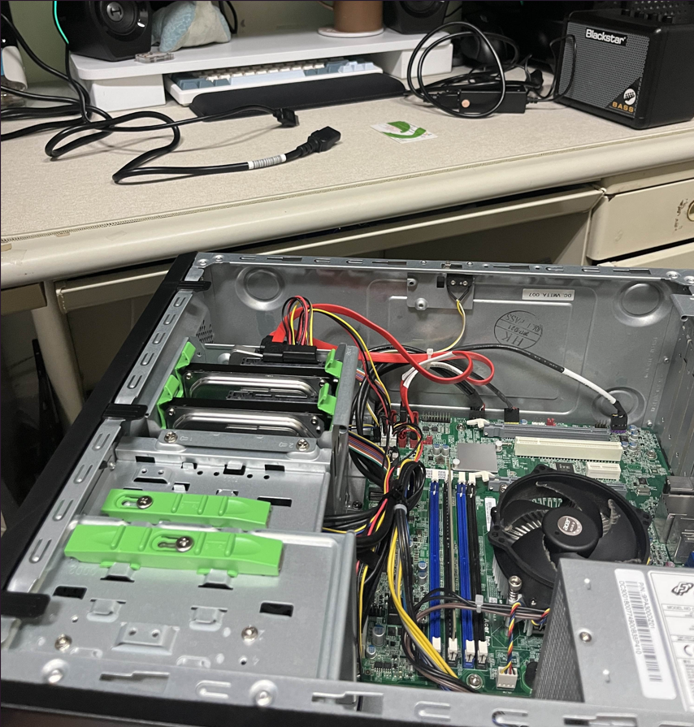

## 前情提要

最近家裡有一台用不到的電腦，雖然 CPU 沒有到特別好，但能裝到 3TB 的硬碟，想說乾脆搬到學校宿舍來當伺服器玩。



或許可以把它當成：
 - 練習用的 Ubuntu 主機（多熟悉Linux
 - 當雲端硬碟使用
 - 未來資安測試環境


希望可以直接用 ssh 直接連過去，藏在書桌下，不需要鍵盤或滑鼠，也能在外面用筆電控制這台 Ubuntu 主機。

但發現學校的宿舍沒有開放外網連線，上網查到有一種方式就是使用 Tailscale 建立虛擬內網的環境，讓不同網路環境下的設備也能像同一個 LAN 裡一樣互相連線，由 Ubuntu 自己往外連到 Tailscale 伺服器，完全不用動到防火牆，後面只需要其他裝置也連到 Tailscale 去，就能用虛擬內網進行通訊。

## 實作流程

1. **在 Ubuntu 上安裝 Tailscale**
   
```bash
curl -fsSL https://tailscale.com/install.sh | sh
```
https://tailscale.com/download

2. **啟動 Tailscale**

```bash
sudo tailscale up
```

3. **登入 Tailscale**

會跳出登入要求，登入後就可以看到這台 Ubuntu 主機的 IP 位址了。

4. **其他裝置上安裝 Tailscale**

在其他裝置上也安裝 Tailscale，並登錄帳號，這時會發現都在個 Tailscale 內網裡面。

5. **測試連線**

記得要先在 Ubuntu 上啟動 SSH 服務，然後就可以試試看用其他裝置連線
```bash
ssh 使用者名稱@tailscale-ip
```

> tailscale-ip 可以利用 `tailscale status` 指令查看所有裝置的 IP 位址。

連線成功後顯示

```yaml
C:\Users\Stanl>ssh user@100.xxx.xxx.xxx
user@100.xxx.xxx.xxx's password:
Welcome to Ubuntu 24.10 (GNU/Linux 6.11.0-26-generic x86_64)

 * Documentation:  https://help.ubuntu.com
 * Management:     https://landscape.canonical.com
 * Support:        https://ubuntu.com/pro

3 updates can be applied immediately.
To see these additional updates run: apt list --upgradable

New release '25.04' available.
Run 'do-release-upgrade' to upgrade to it.

Web console: https://hostname:9090/ or https://xxx.xxx.xxx.xxx:9090/

Last login: Wed Jun 25 21:35:48 2025 from 100.xxx.xxx.xxx
user@hostname:~$
```

## 補充

我自己是還有裝 fail2ban，防止自己有一台電腦被入侵後，攻擊者可以直接 SSH 暴力破解進去。

```bash
sudo apt update
sudo apt install fail2ban
```

並設定 Bios 中的 Restore on AC Power Loss 確保伺服器斷電後還能自動開機。